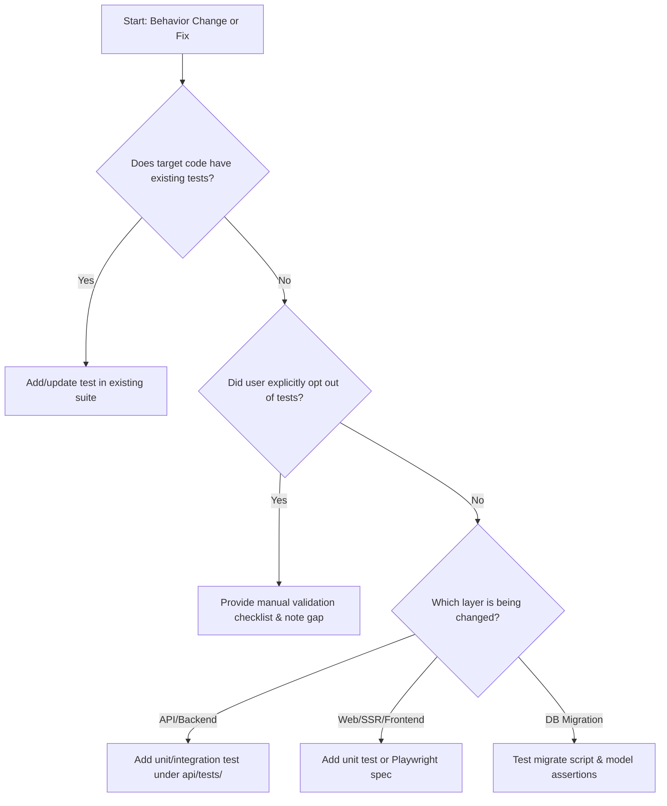

# Testing Strategy & Decision Tree

Use this decision tree to determine the validation path when introducing behavior changes, bug fixes, or refactors.

## Step-by-Step Decision Rules

1. **Existing Automated Tests**:
   - If the modified module already has unit or integration test coverage (e.g. under `api/tests/` or `web/tests/`), add or update failing test cases to cover the new code path before writing implementation logic.

2. **No Existing Test Suite**:
   - For `api/` changes, add unit tests targeting `api/model/`, `api/helpers/`, or `api/routes/`.
   - For `web/` changes, run `npm run build` and add render/model unit tests or update Playwright specs under `web/playwright/`.

3. **Explicit User Opt-Out**:
   - If the user explicitly asks not to write automated tests, create a manual step-by-step verification checklist and explicitly report the automated testing gap.
